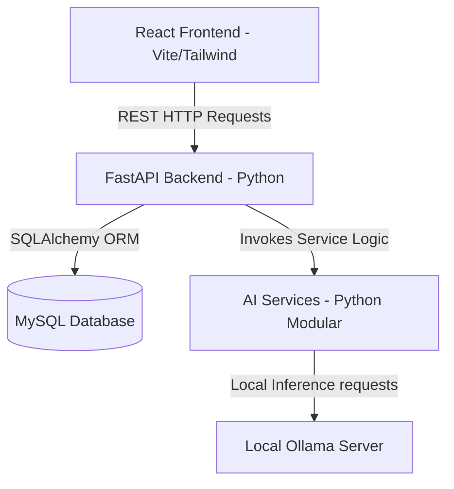

# Bookophilic Architecture Overview

Bookophilic is built as a modular full-stack application separating user interfaces, database persistence, and cognitive intelligence operations.

## Modular Layers

### 1. Frontend Layer (`frontend/`)
- Scaffolding: Vite + React 19 + Tailwind CSS.
- Communication: Axios client services matching backend paths.
- Components: Glassmorphism-themed dashboards, study flashcards, and navigation elements.

### 2. Backend API Layer (`backend/`)
- API Engine: FastAPI for lightweight routing, cors processing, and dependency validation.
- Object-Relational Mapper (ORM): SQLAlchemy mapping tables to MySQL objects.
- Configurations: Configured dynamically via `.env` files.

### 3. AI Services Layer (`ai-services/`)
- Separation: Runs completely separate from database router files to avoid dependencies coupling.
- Ollama Client: Direct connector to local LLM engines.
- Memory Engine: Spaced repetition logic matching the SuperMemo SM-2 math formula.
- Vector store: Custom JSON-based vector store loading embeddings inside `dataset/embeddings`.
